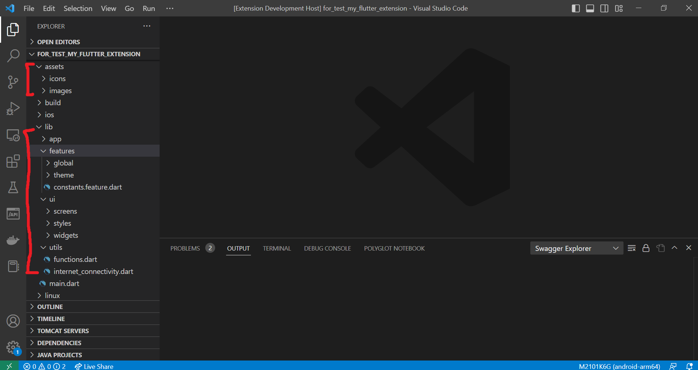

# Change Log

All notable changes to the "gk-flutter-getx-pattern" extension will be documented in this file.

Check [Keep a Changelog](https://keepachangelog.com/) for recommendations on how to structure this file.

## [Unreleased]

- Initial release

## v0.0.2 Changes :
* Active README file

## v0.0.3 Changes :
* Init GetX feature has been activated : 
    - Create Theme feature
    - Create Splash screen
    - Create MainApp, Routes and Routing