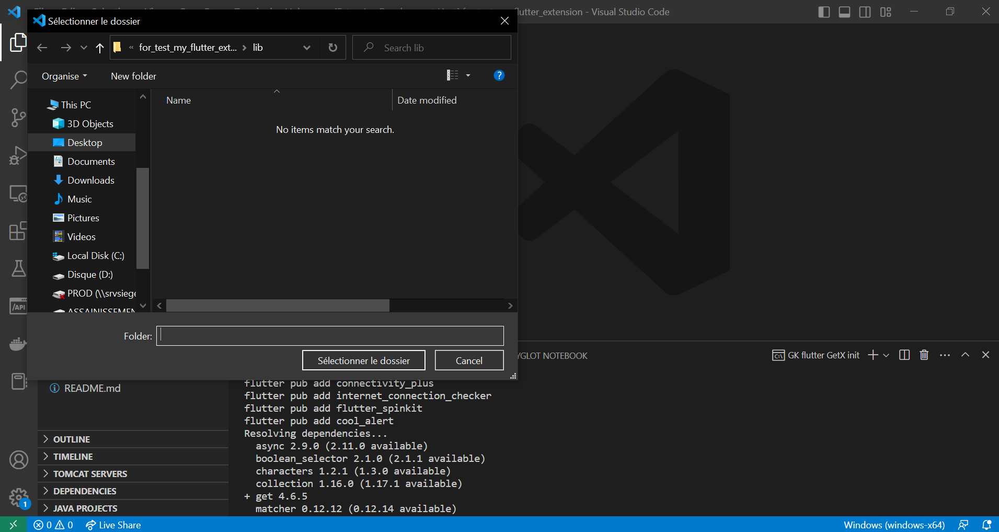
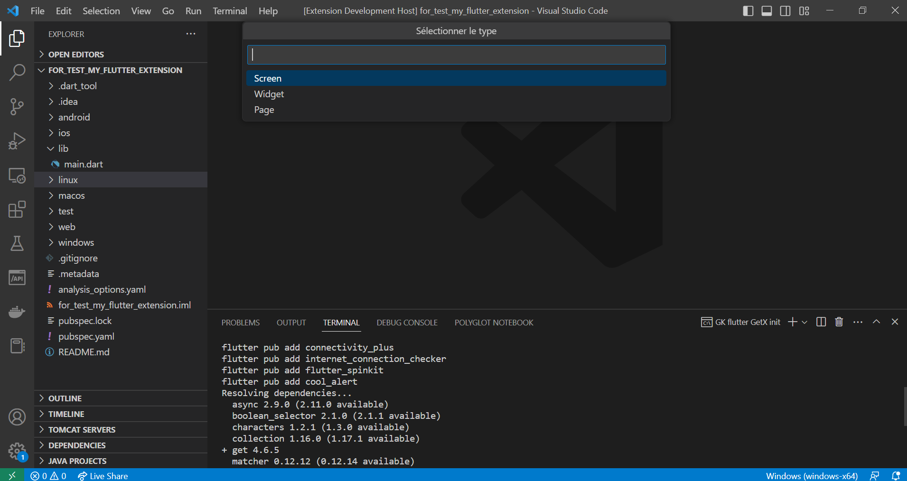
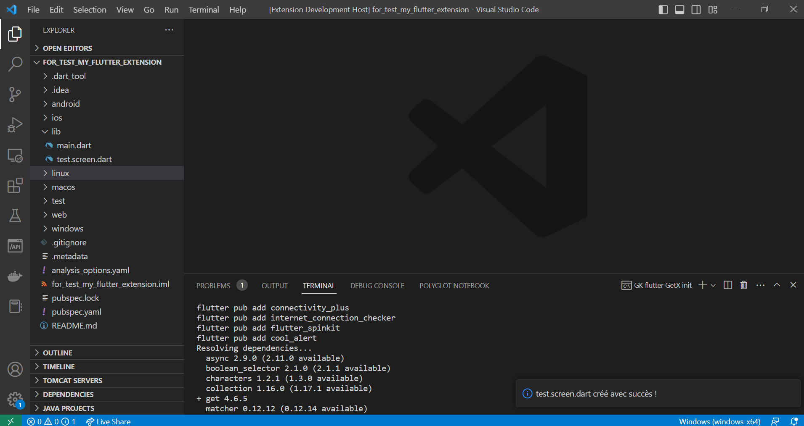

# GK flutter GetX pattern README

This is the README for your extension "gk-flutter-getx-pattern". After writing up a brief description, we recommend including the following sections.

## Features
* GK flutter GetX init
* GK flutter statefull file
* GK flutter stateless file
Cette extension permet de créer des composants Statefull ou Stateless avec un nommage bien spécifique
des fichers ainsi que du composant.
Por ce faire, vous devez choisir le dossier de destination du fichier à créer.
Ensuite, sélectionner le type de composant (Screen, Page, Widget...). Enfin, saisir le nom de base du fichier qui sera également utilisé pour nommer le composant.
Ex. :
    - Feature = GK flutter statefull file
    - Type = Screen
    - Name = test
Un fichier nommé test.screen.dart sera créé dans le répertoire choisit et le composant sera nommé TestScreen.

## Requirements

If you have any requirements or dependencies, add a section describing those and how to install and configure them.

## Extension Settings

Include if your extension adds any VS Code settings through the `contributes.configuration` extension point.

For example:

This extension contributes the following settings:

* `myExtension.enable`: Enable/disable this extension.
* `myExtension.thing`: Set to `blah` to do something.

## Known Issues

Calling out known issues can help limit users opening duplicate issues against your extension.

## Release Notes

Users appreciate release notes as you update your extension.

### 1.0.0

Initial release of ...

### 1.0.1

Fixed issue #.

### 1.1.0

Added features X, Y, and Z.

---

## Following extension guidelines

Ensure that you've read through the extensions guidelines and follow the best practices for creating your extension.

* [Extension Guidelines](https://code.visualstudio.com/api/references/extension-guidelines)

## Working with Markdown

You can author your README using Visual Studio Code. Here are some useful editor keyboard shortcuts:

* Split the editor (`Cmd+\` on macOS or `Ctrl+\` on Windows and Linux).
* Toggle preview (`Shift+Cmd+V` on macOS or `Shift+Ctrl+V` on Windows and Linux).
* Press `Ctrl+Space` (Windows, Linux, macOS) to see a list of Markdown snippets.

## For more information

* [Visual Studio Code's Markdown Support](http://code.visualstudio.com/docs/languages/markdown)
* [Markdown Syntax Reference](https://help.github.com/articles/markdown-basics/)

**Enjoy!**